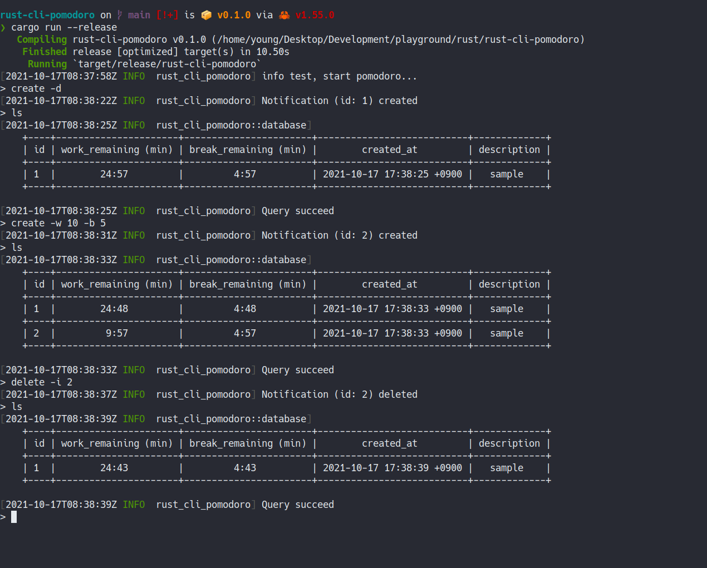

# ⏱️⌛ rust-cli-pomodoro

## [Table of Contents](#table-of-Contents)
- [Demo](#demo)
- [💡 Motivation](#motivation)
- [📜 Features](#features)
- [⌛ How to use](#how-to-use)
- [🚧 RoadMap](#roadmap)
- [🖥️ Compatibility](#compatibility)


## Demo




## Motivation

[Pomodoro technique](https://en.wikipedia.org/wiki/Pomodoro_Technique) is a time management method (Refer the link for more information). Typically 25 minutes works and 5 minutes break is one set.  
For me, while I'm working I found intentional break time is needed for the better performance and health (do some stretching 5 minutes). So I made it.


## Features  

A `notification` is consisted of work time and break time. Pomodoro manages timer using `notification`.

- Create notification with customized work and break time
- Pretty print created notifications
- delete registered notification(s)
- clear terminal

for more features, run `pomodoro` and type `help`!


```md
pomodoro 0.0.1
Young
manage your time!

USAGE:
    pomodoro [SUBCOMMAND]

FLAGS:
    -h, --help       Prints help information
    -v, --version    Prints version information

SUBCOMMANDS:
    clear     clear terminal
    create    create a notification
    delete    delete a notification
    exit      exit pomodoro app
    help      Prints this message or the help of the given subcommand(s)
    list      list notifications long command
    ls        list notifications short command
    test      test notification
```


## How to use

Currently just clone this repo and run `cargun run --release` or build your self and use binary as you wish.

```sh
git clone git@github.com:24seconds/rust-cli-pomodoro.git
cd rust-cli-pomodoro
cargo run --release
```


## RoadMap

- [ ] Support mac os (>= 11.0.0) notification: Currently [notify-rust](https://github.com/hoodie/notify-rust) uses [mac-notification-sys](https://github.com/h4llow3En/mac-notification-sys) but `mac-notification_sys` doesn't support recent mac version (as of 17:10 Sun 17 Oct 2021)
- [ ] Provide more notification delivery option: Currently pomodoro uses desktop notification. But notification could be delivered through slack, email or any kind of method.
- [ ] Provide an easy way to use this app (brew, snap, cargo install, etc..)
- [ ] More rich notification: sound, app icon, hint, action etc
- [ ] Write test cases 

## Compatibility

It depends on [notify-rust](https://github.com/hoodie/notify-rust) support, so Linux, Mac (<= 11.0.0) and Windows (10, 8.1).
