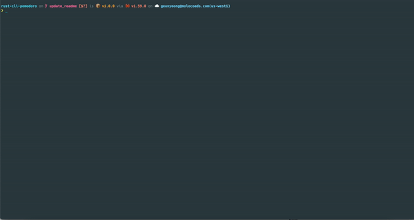

# ⏱️⌛ rust-cli-pomodoro

## [Table of Contents](#table-of-Contents)
- [Demo](#demo)
- [💡 Motivation](#motivation)
- [👷🏻‍♀️ Architecture](#architecture)
- [📜 Features](#features)
- [⌛ Installation & How to use](#installation-and-how-to-use)
- [🚧 RoadMap](#roadmap)
- [🖥️ Compatibility](#compatibility)


## Demo




## Motivation

[Pomodoro technique](https://en.wikipedia.org/wiki/Pomodoro_Technique) is a time management method (Refer the link for more information). Typically 25 minutes works and 5 minutes break is one set.
For me, while I'm working I found intentional break time is needed for the better performance and health (do some stretching 5 minutes). So I made it.

## Architecture
Pomodoro supports two input types, standard input and IPC (via unix domain socket). To support them, the pomodoro app architecture looks like this.  
  

## Features

Currently pomodoro provide the features listed as below. for more features, run `pomodoro` and type `help`!
- Create notification with customized work and break time
- Queue the notification. Queued notification will start to run after previously registered notifications are finished
- Customize notification delivery channels. Refer [Using credential.json section](#Using-credential.json)
- Pretty print created notifications using `list` command
- Delete registered notification(s)
- Track delete notification(s) using `history` command
- Clear terminal
(A `notification` is consisted of work time and break time. Pomodoro manages timer using `notification`.)


Depend on the input types, command is provided slightly differently. 
### Start up & IPC command

If you want to start up, run the pomodoro with proper `OPTIONS`.
Or if you want to send command to already started up pomodoro (via IPC), run the command with `SUBCOMMANDS`


```md
pomodoro 1.2.0-beta.0
Young
start up application with config or run command using uds client

USAGE:
    pomodoro [OPTIONS]
    pomodoro <SUBCOMMAND>

OPTIONS:
    -c, --config <FILE>    read credential json file from this path
    -h, --help             Print help information
    -V, --version          Print version information

SUBCOMMANDS:
    create     create the notification
    delete     delete a notification
    help       Print this message or the help of the given subcommand(s)
    history    show archived notifications
    list       list notifications
    queue      create the notification
    test       test notification
```


### Standard input command

While pomodoro is running, you can interactively make command.


```md
pomodoro 1.2.0-beta.0
Young
manage your time!

USAGE:
    pomodoro [SUBCOMMAND]

OPTIONS:
    -h, --help       Print help information
    -V, --version    Print version information

SUBCOMMANDS:
    clear      clear terminal
    create     create the notification
    delete     delete a notification
    exit       exit pomodoro app
    help       Print this message or the help of the given subcommand(s)
    history    show archived notifications
    list       list notifications
    queue      create the notification
    test       test notification
```


## Installation and How to use

### Installation 
1. Currently just clone this repo and run `cargo run --release` or build your self and use binary as you wish.

```sh
git clone git@github.com:24seconds/rust-cli-pomodoro.git
cd rust-cli-pomodoro
cargo run --release
```

2. Use `cargo install rust-cli-pomodoro`
```sh
cargo install rust-cli-pomodoro
```

### Using credential.json
pomodoro support slack notification.
To use it, you need to create `credential.json` file in somewhere in your local machine. `credential.json` supports two keys, `slack` and `discrod`.
The `slack` and `discord` value is json. It looks like this

```json
{
  "slack": {
      "token": "your-bot-token-string",
      "channel": "your-slack-channel-id"
  },
  "discord": {
      "webhook_url": "your-webhook-url"
  }
}
```

For the slack notification, It uses [chat.PostMessage API](https://api.slack.com/methods/chat.postMessage)

To run pomodoro with `credential.json`, run the app like this.
```sh
# If the credential.json file exists in the current path
pomodoro --config ./credential.json
```


## RoadMap

- [ ] Run previous command if needed
- [ ] Command auto completion
- [o] Write test cases 
- [ ] More rich notification: sound, app icon, hint, action etc
- [o] Provide more notification delivery option: Currently pomodoro uses desktop notification. But notification could be delivered through slack, email or any kind of method.
    - [v] slack integration
    - [v] discord integration
    - what else?
- [o] Provide an easy way to use this app (brew, snap, cargo install, etc..)
    - [v] cargo install


------

- [v] Support mac os (>= 11.0.0) notification: Currently [notify-rust](https://github.com/hoodie/notify-rust) uses [mac-notification-sys](https://github.com/h4llow3En/mac-notification-sys) but `mac-notification_sys` doesn't support recent mac version (as of 17:10 Sun 17 Oct 2021) => published binary can send desktop notification without problem (01:21 Fri 13 May 2022)


## Compatibility

### Start up & Standard input
It depends on [notify-rust](https://github.com/hoodie/notify-rust) support, so Linux, Mac (<= 11.0.0) and Windows (10, 8.1).
- note: If you use this app by installing `cargo install` command, then macOs desktop notification seems to work well (Sun 03 Apr 2022)

### IPC
Currently Linux and Mac are supported (as pomodoro used unix domain socket)