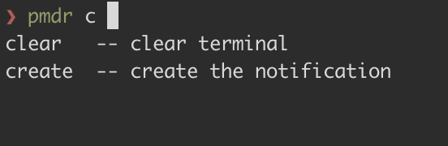

# ⏱️⌛ rust-cli-pomodoro

## [Table of Contents](#table-of-Contents)
- [⏱️⌛ rust-cli-pomodoro](#️-rust-cli-pomodoro)
  - [Table of Contents](#table-of-contents)
  - [Demo](#demo)
  - [Motivation](#motivation)
  - [Architecture](#architecture)
  - [Features](#features)
    - [Start up \& IPC command](#start-up--ipc-command)
    - [Standard input command](#standard-input-command)
  - [Installation and How to use](#installation-and-how-to-use)
    - [Installation](#installation)
    - [Using configuration.json](#using-configurationjson)
    - [Auto completion](#auto-completion)
      - [Step 1. Generate completion script file using command](#step-1-generate-completion-script-file-using-command)
      - [Step 2. Put the completion script file to proper path](#step-2-put-the-completion-script-file-to-proper-path)
      - [Step 3. rerun the zsh shell and enjoy!](#step-3-rerun-the-zsh-shell-and-enjoy)
  - [RoadMap](#roadmap)
  - [Compatibility](#compatibility)
    - [Start up \& Standard input](#start-up--standard-input)
    - [IPC](#ipc)


## Demo


## Motivation

[Pomodoro technique](https://en.wikipedia.org/wiki/Pomodoro_Technique) is a time management method (Refer the link for more information). Typically 25 minutes works and 5 minutes break is one set.
For me, while I'm working I found intentional break time is needed for the better performance and health (do some stretching 5 minutes). So I made it.

## Architecture
Pomodoro supports two input types, standard input and IPC (via unix domain socket). To support them, the pomodoro app architecture looks like this.  
  

## Features

Currently pomodoro provide the features listed as below. for more features, run `pomodoro` and type `help`!
- Create notification with customized work and break time
- When configuration file is given, notification is created with default values specified in the file
- Queue the notification. Queued notification will start to run after previously registered notifications are finished
- Customize notification delivery channels. Refer [Using configuration.json section](#Using-configuration.json)
- Pretty print created notifications using `list` command
- Delete registered notification(s)
- Track archived notification(s) using `history` command
- Delete archived notifications using `history --clear` command
- Clear terminal
- Support command history look up with arrow key in interaction mode.
(A `notification` is consisted of work time and break time. Pomodoro manages timer using `notification`.)
- Generate auto completion script for several shells (fish, zsh, bash, elvish, powershell)


Depend on the input types, command is provided slightly differently. 
### Start up & IPC command

If you want to start up, run the pomodoro with proper `OPTIONS`.
Or if you want to send command to already started up pomodoro (via IPC), run the command with `SUBCOMMANDS`


```md
pomodoro 1.4.0
Young
start up application with config or run command using uds client

Usage: pomodoro [OPTIONS]
       pomodoro <COMMAND>

Commands:
  create      create the notification
  queue       create the notification
  delete      delete a notification
  list        list notifications
  history     show archived notifications
  test        test notification
  completion  generate completions for shells
  help        Print this message or the help of the given subcommand(s)

Options:
  -c, --config <config>  Read configuration json file from this path
  -h, --help             Print help
  -V, --version          Print version
```


### Standard input command

While pomodoro is running, you can interactively make command.


```md
pomodoro 1.4.0
Young
manage your time!

Usage: pomodoro [COMMAND]

Commands:
  create   create the notification
  queue    create the notification
  delete   delete a notification
  list     list notifications
  history  show archived notifications
  test     test notification
  clear    clear terminal
  exit     exit pomodoro app
  help     Print this message or the help of the given subcommand(s)

Options:
  -h, --help     Print help
  -V, --version  Print version
```


## Installation and How to use

### Installation 
1. Currently just clone this repo and run `cargo run --release` or build your self and use binary as you wish.

```sh
git clone git@github.com:24seconds/rust-cli-pomodoro.git
cd rust-cli-pomodoro
cargo run --release
```

2. Use `cargo install rust-cli-pomodoro`
```sh
cargo install rust-cli-pomodoro
```

### Using configuration.json
pomodoro supports several configurations.
- slack notification
- discord notification
- work time default value
- break time default value

To use it, you need to create json file, for exmplae `configuration.json` in somewhere in your local machine.
`Configuration.json` file looks like below.

```json
{
  "slack": {
      "token": "your-bot-token-string",
      "channel": "your-slack-channel-id"
  },
  "discord": {
      "webhook_url": "your-webhook-url"
  },
  "work_time_default_value": 30,
  "break_time_default_value": 10
}
```

For the slack notification, It uses [chat.PostMessage API](https://api.slack.com/methods/chat.postMessage)

For the discord notification, It uses [webhook url](https://discord.com/developers/docs/resources/webhook)

To run pomodoro with `configuration.json`, run the app like this.
```sh
# If the configuration.json file exists in the current path
pomodoro --config ./configuration.json
```

### Auto completion
`rust-cli-pomodoro` supports auto completion. But you need to generate the completion script manually and put it to the proper path.

Auto completion is tab completion. When you typed a few character and press tab, then you can see the possible commands like this.




#### Step 1. Generate completion script file using command
You need to run the command to get completion script. The command looks like below.  

```sh
Usage: pomodoro completion [shell]

Arguments:
  [shell]  [possible values: fish, zsh, bash, elvish, powershell]
```

For example, if you run `pomodoro completion zsh` then the script will be printed through standard output. Therefore, you need to do like this.  
```sh
$ pomodoro completion zsh > _pomodoro
```
The file name should be underscord + binary name, which is `_pomodoro`.

#### Step 2. Put the completion script file to proper path
Put the completion script file to proper path. For example, in zsh shell, the proper path is one of `$fpath`. You can check by running this command.  

```sh
> echo $fpath
```

In my case, I put the completion script under `/Users/young/.oh-my-zsh/completions`.  

#### Step 3. rerun the zsh shell and enjoy!
To use the auto completion, you need to run this command for opened terminals. For the newly opened terminals, auto completion will work without problem.

```sh
$ exec zsh
# or
$ source ~/.zshrc
```

Enjoy!

## RoadMap

- [x] Run previous command if needed
- [x] Command auto completion
- [ ] Write integration tests
- [ ] More rich notification: sound, app icon, hint, action etc
- [ ] Provide more notification delivery option: Currently pomodoro uses desktop notification. But notification could be delivered through slack, email or any kind of method.
    - [x] slack integration
    - [x] discord integration
    - what else?
- [ ] Provide an easy way to use this app (brew, snap, cargo install, etc..)
    - [x] cargo install
- [ ] What else?

------

- [x] Support mac os (>= 11.0.0) notification: Currently [notify-rust](https://github.com/hoodie/notify-rust) uses [mac-notification-sys](https://github.com/h4llow3En/mac-notification-sys) but `mac-notification_sys` doesn't support recent mac version (as of 17:10 Sun 17 Oct 2021) => published binary can send desktop notification without problem (01:21 Fri 13 May 2022)


## Compatibility

### Start up & Standard input
It depends on [notify-rust](https://github.com/hoodie/notify-rust) support, so Linux, Mac (<= 11.0.0) and Windows (10, 8.1).
- note: If you use this app by installing `cargo install` command, then macOs desktop notification seems to work well (Sun 03 Apr 2022)

### IPC
Currently Linux and Mac are supported (as pomodoro used unix domain socket)